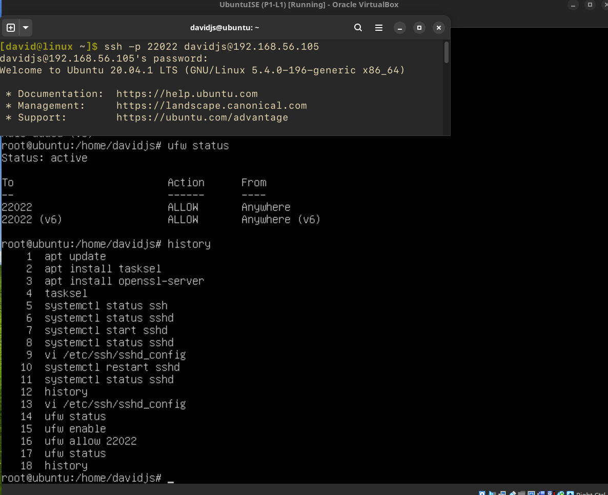
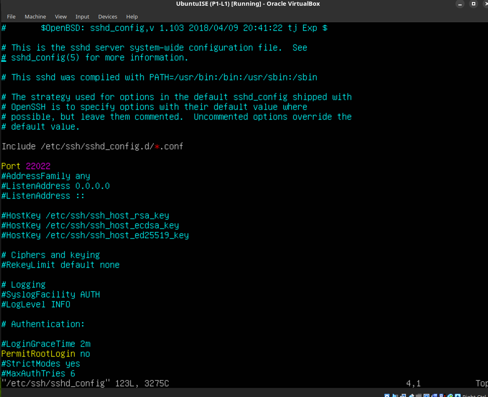
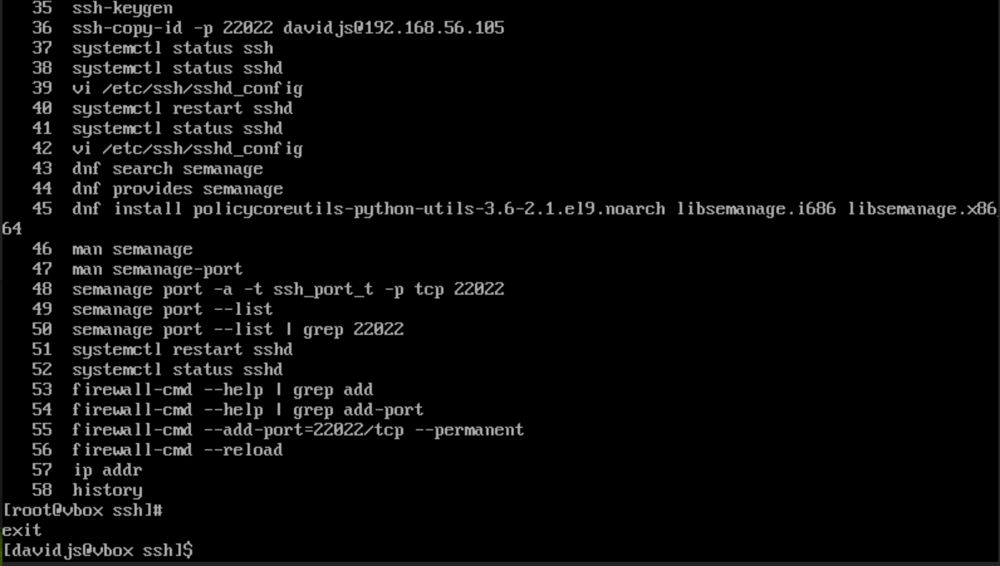
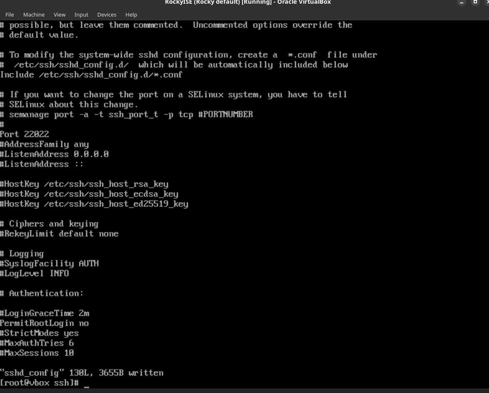

## Práctica 2 - Lección 1

### Ubuntu

History de los comandos realizados


Fichero de configuración ```/etc/ssh/sshd_config```


---

### Rocky Linux

History de los comandos realizados


Fichero de configuración ```/etc/ssh/sshd_config```

