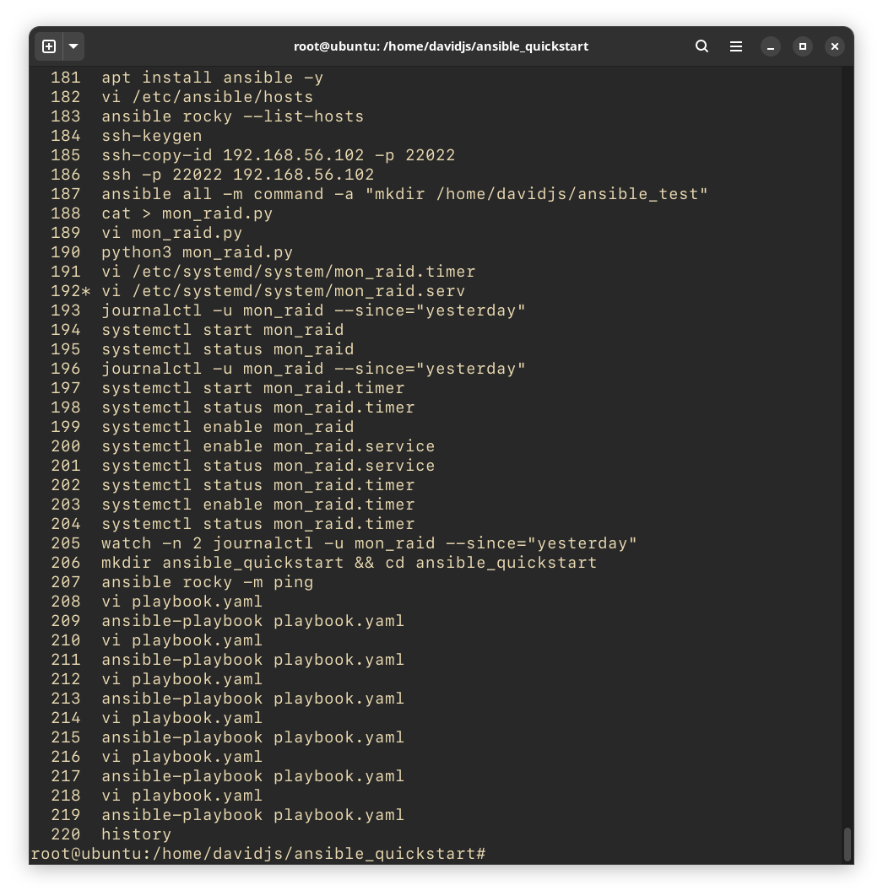
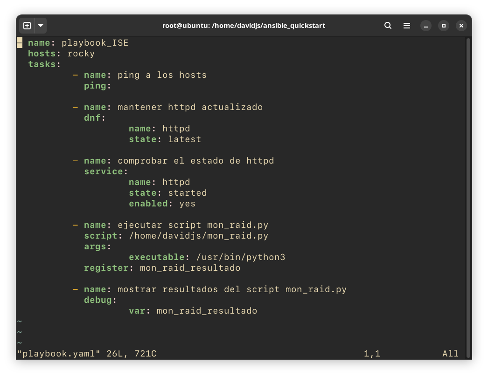
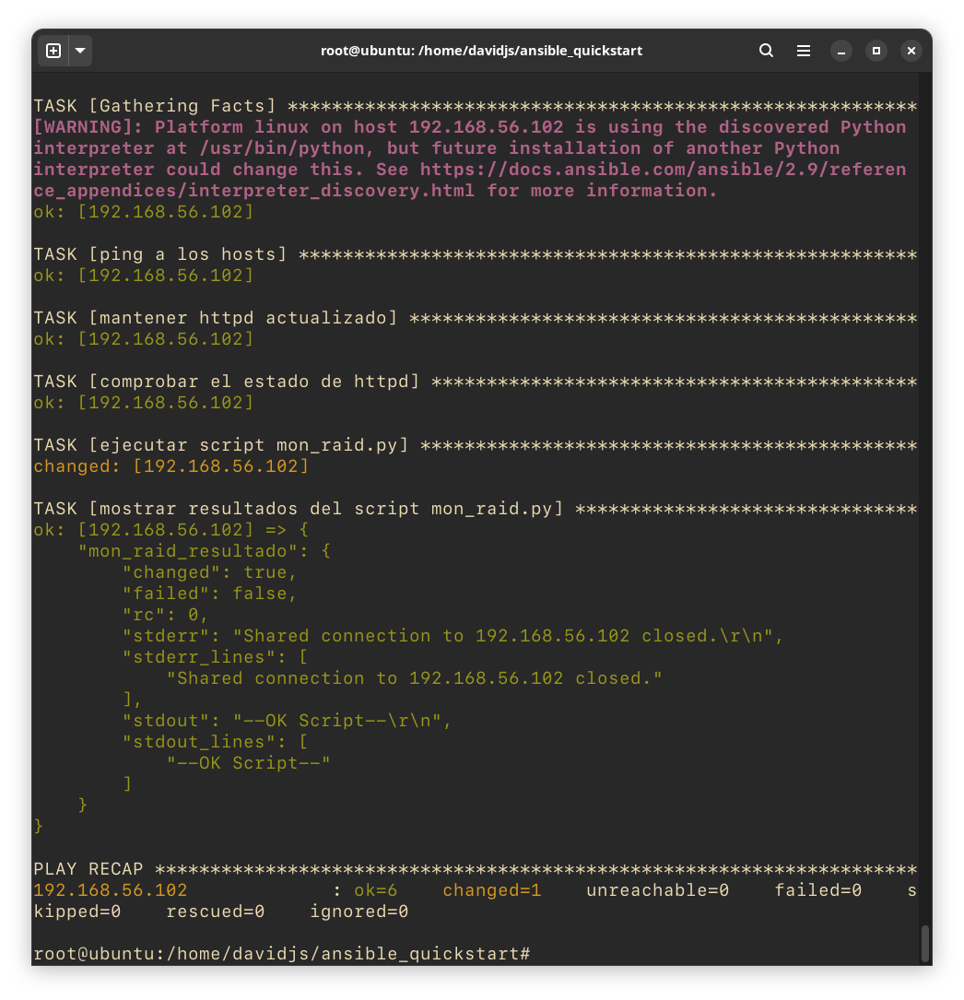
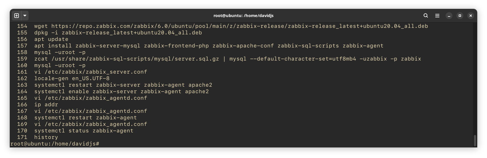
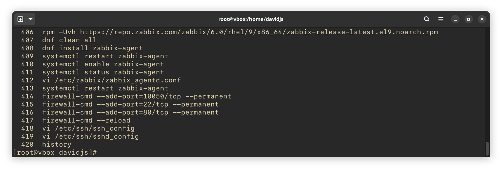
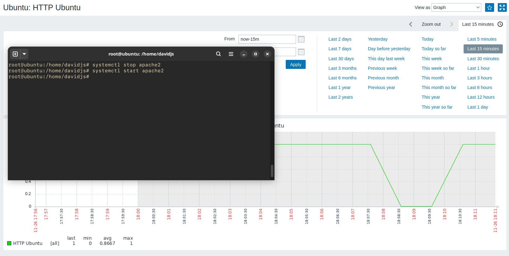
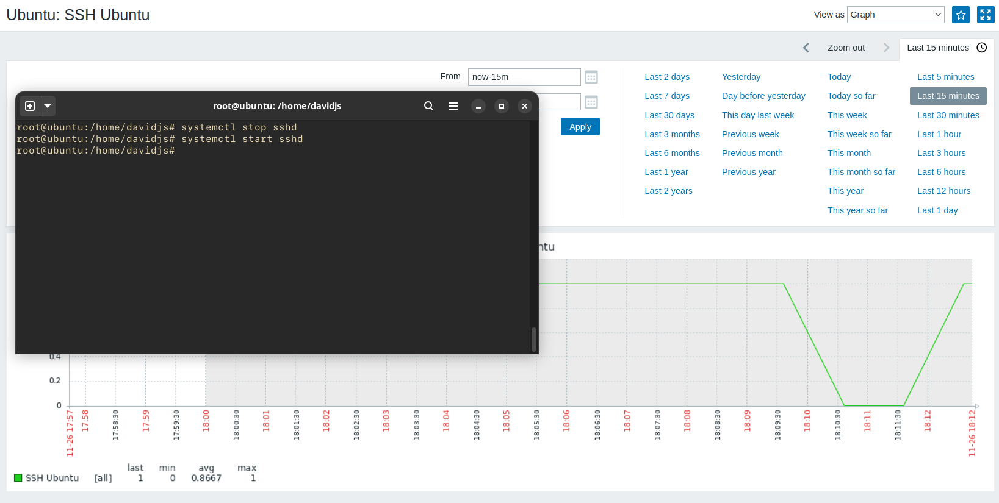
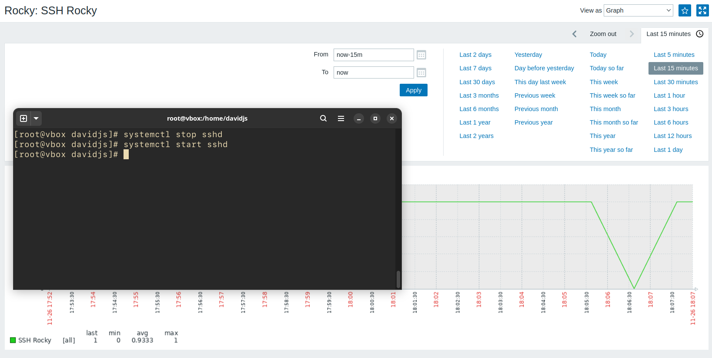

# Práctica 3 - Monitorización, automatización y profiling

## Ansible

History de los comandos realizados para configurar y usar Ansible desde Ubuntu sobre Rocky Linux.
 

Playbook con las siguientes tareas:
- Realizar un ping a Rocky Linux.
- Mantener la última versión de httpd mediante el gestor de paquetes dnf.
- Asegurarse de que el daemon de httpd está activo.
- Ejecución del script de Python para monitorear el RAID.
 

Ejecución del playbook descrito.
 

---

## Zabbix

History de los comandos realizados para configurar el servidor de Zabbix en Ubuntu.

History de los comandos realizados para configurar el agente de Zabbix en Rocky Linux.

Monitorización del servidor HTTP de Ubuntu
 

Monitorización del servidor SSH de Ubuntu
 

Monitorización del servidor HTTP de Rocky Linux
 

Monitorización del servidor SSH de Rocky Linux
 
